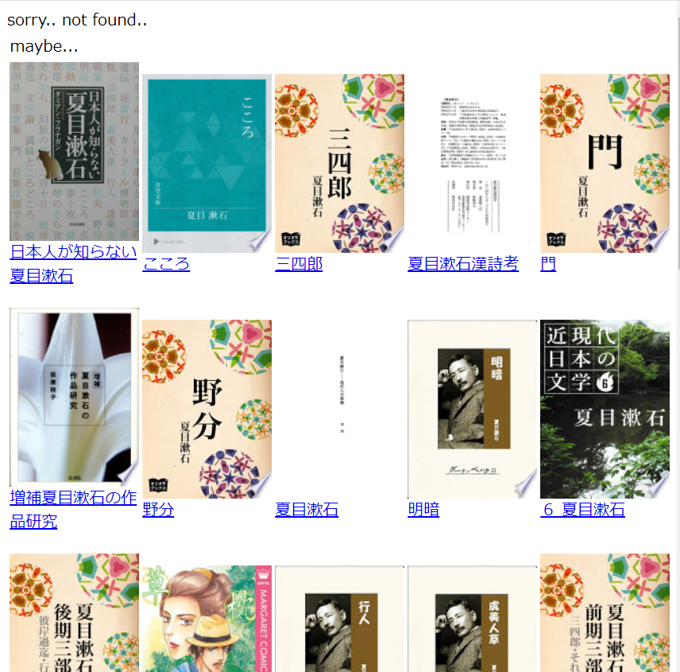
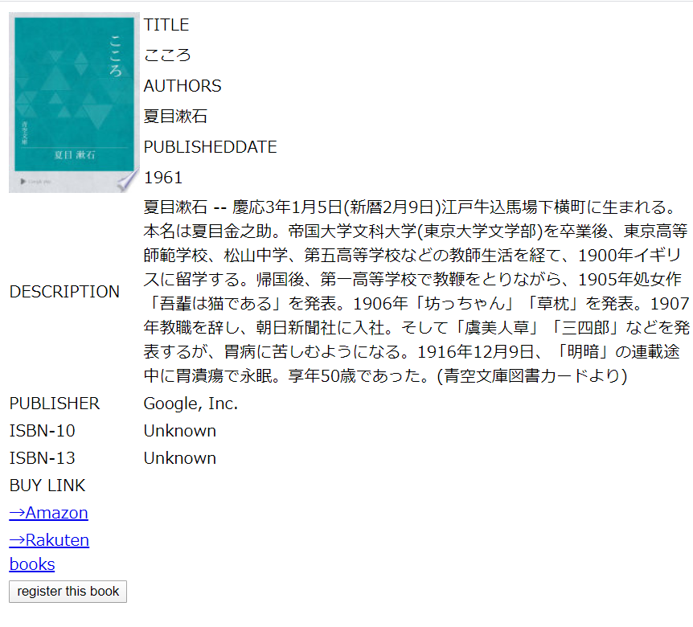

# 書籍管理システム
書籍管理システムのWebアプリケーションです．

使用言語は，Html，JavaScript，Python，SQL

Pythonのゲートウェイインターフェース規格 (CGI) を用いています．

GoogleBooksAPIを用いたWebアプリケーションで，構築やJavaScriptについて興味を抱いたため作成しました．

実行の確認はローカルネットワークのみでしています．

サーバーの立て方は[こちら](https://qiita.com/goodboy_max/items/833d482827bf0efab45a)を参考にしました．

# アプリ―ケーションの動作説明
まず，[ログイン画面](https://github.com/alain0077/study_html/blob/master/WEBDIR/login.html)にアクセスすると，下のような画面が表示され，ユーザIDとパスワードの入力を促される．

＜ログイン画面＞

登録済のユーザデータは，userlist.dbで管理されており，そこにある情報と入力された文字列が間違っていれば，下の画面になり，「Username or Password do not match！Try again！」と表示するようになっている．

＜例外処理の例＞

次に，未登録者の為の[レジスタ画面](https://github.com/alain0077/study_html/blob/master/WEBDIR/register.html)は[ログイン画面](https://github.com/alain0077/study_html/blob/master/WEBDIR/login.html)から遷移可能で，下図のような表示がされる．

＜レジスタ画面＞

登録情報に誤りがある場合は，次のような誤りに応じた例外処理をしている．例えば，既に使われているUsernameが用いられれば，下のような画面になる．

＜例外処理の例＞

ここからが，書籍管理システムの本体で，
ログインに成功すると，[検索登録画面](https://github.com/alain0077/study_html/blob/master/WEBDIR/bookmanaging.html)に遷移する．ここでは，bookdb.dbに登録視されている書籍のタイトルの検索とそのデータベースへの登録ができる．

＜書籍検索・登録画面＞

検索したワードに関わるタイトルの書籍がbookdb.dbにあった場合は，下のような画面が表示される．

＜Javaと検索した例＞

この画面表示されているタイトル名をクリックすると，その書籍についての詳細が表示される．

＜書籍の詳細表示＞

また，検索ワードに関わるタイトルの書籍が見つからなかった場合は，GoogleBooksAPIで書籍の検索を掛けて，次のような表示する．

＜見つからなかった場合＞

そして，もし探していたタイトルや気になった書籍の画像をクリックすると書籍の詳細が表示される．

＜書籍の詳細表示＞

この画面では下部にある「register this book」ボタンをクリックすると，bookdb.dbに保存することが可能である．

# 得られた知見
普段閲覧しているWebサイトがどのように動作しているのかが気になり，本アプリケーションの作成に取り掛かかりました．Webアプリケーションの構築の仕方を知れば知るほど，普段利用しているサイトが，どのような動きをしているのかを理解するのに繋がり，とても楽しく作成が出来ました．URLでのクエリの渡し方や，GoogleBooksAPIに検索ワードを投げると返ってくるJsonファイルの扱い方など新しい発見や知識を付けることが出来ました．